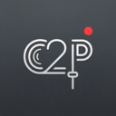
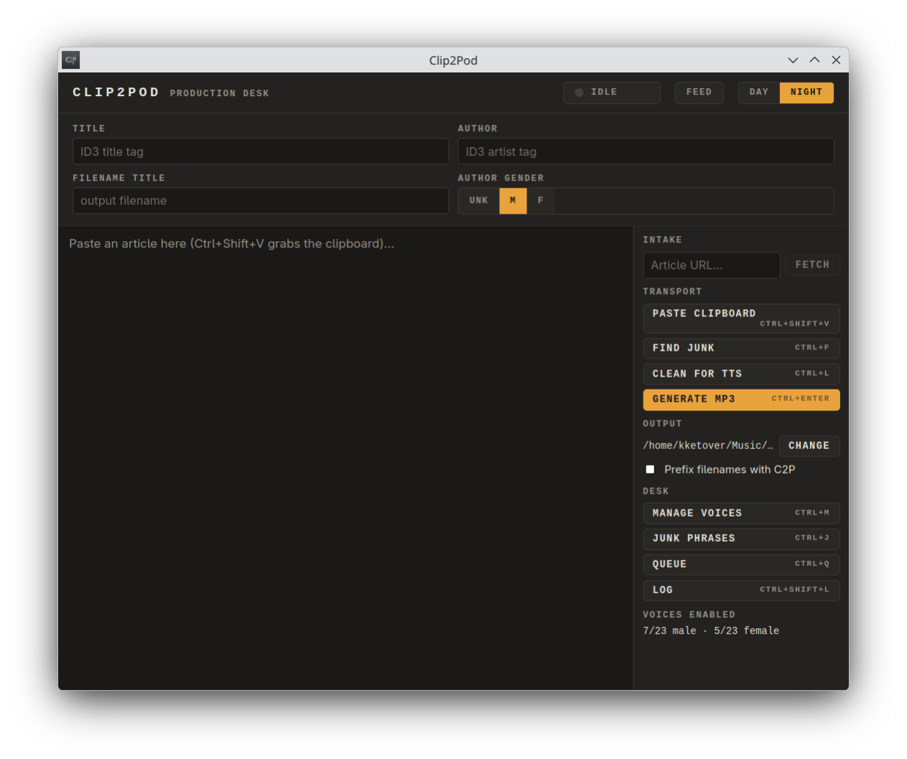

<p align="center">
  
</p>

<h1 align="center">Clip2Pod</h1>

<p align="center">
  Turn any article into a narrated MP3 — and listen to it as your own private podcast feed.
</p>

<p align="center">
  <a href="LICENSE"></a>
  
  
  
  
</p>

---



Clip2Pod is a desktop "production desk" for converting written content into audio. Paste an article (or send it straight from your browser), clean it up like a radio script, and generate an MP3 narrated by one of Microsoft Edge's neural text-to-speech voices. Finished episodes are tagged, named safely, and served over a local RSS feed — so your phone's podcast app can subscribe and download them like any other show.

**The core loop:** article → script → voice → MP3 → podcast feed.

## Features

- **Four ways in** — paste from the clipboard (`Ctrl+Shift+V`), fetch an article by URL, press the global hotkey (`Ctrl+Alt+G`) from anywhere, or click the companion browser extension to send the page you're reading (paywalled content included, since it captures your logged-in session).
- **Readability extraction** — web pages are boiled down to title, author, and article text; navigation, ads, and boilerplate are stripped automatically.
- **Script cleanup tools** — one-click *Clean for TTS* normalizes smart punctuation, strips emoji and decorative symbols, and collapses whitespace. A *junk phrase finder* walks you through lines that read badly aloud ("Getty Images", "min read", raw URLs…), with a fully editable phrase list.
- **Spoken intros** — each episode opens with its title and author ("*My Title. By Jane Doe.*"), skipped automatically if the text already starts that way.
- **A real voice library** — audition, enable, and disable any of Edge's English neural voices. Voices rotate round-robin (and alternate gender when the author's gender is unknown) so a backlog of episodes doesn't sound monotonous.
- **Background queue** — generation never blocks the UI. A status lamp shows `IDLE` / `QUEUED n` / `ON AIR`, and a full log records every job with the voice used.
- **Proper MP3s** — ID3 tags (title, artist, album, narrating voice), sanitized collision-safe filenames, optional `C2P_` prefix.
- **Built-in podcast feed** — a local RSS server (port `4738`) lists every generated episode with cover art. Scan the QR code in the app with your phone and subscribe in any podcast client on your network.
- **Quality of life** — light/dark themes, system tray (closing the window keeps it running), and every setting persisted between sessions.

## Installation

### Prebuilt packages (Linux)

Grab the latest build from the [Releases](../../releases) page:

| Package | For |
|---|---|
| `Clip2Pod_x.y.z_amd64.AppImage` | Any distro — `chmod +x` and run |
| `Clip2Pod_x.y.z_amd64.deb` | Debian, Ubuntu, Mint |
| `Clip2Pod-x.y.z-1.x86_64.rpm` | Fedora, openSUSE |

```sh
chmod +x Clip2Pod_*.AppImage
./Clip2Pod_*.AppImage
```

### Build from source

Prerequisites: [Rust](https://rustup.rs) (stable), [Node.js](https://nodejs.org) 18+, and the [Tauri 2 system dependencies](https://tauri.app/start/prerequisites/) for your platform (on Linux: `webkit2gtk-4.1`, `libappindicator3`, etc.).

```sh
git clone https://github.com/FlocktimusPrime/Clip2Pod.git
cd Clip2Pod
npm install
npm run tauri build          # bundles land in src-tauri/target/release/bundle/
```

For development with hot reload:

```sh
npm run tauri dev
```

### Browser extension (Chrome / Brave / Edge)

The extension sends the article you're reading — as rendered in your logged-in browser session — straight to the Clip2Pod editor.

1. Open `chrome://extensions` (or `brave://extensions`, `edge://extensions`).
2. Enable **Developer mode** (top-right toggle).
3. Click **Load unpacked** and choose the [`extension/`](extension/) folder.

The extension only acts when clicked, only on the active tab, and only talks to `127.0.0.1:4737` — the Clip2Pod app on your own machine. See [`extension/README.md`](extension/README.md) for details.

## Usage

### Quick start

1. Copy an article (or click the browser extension, or paste a URL into the **Intake** field and hit **Fetch**).
2. **Paste Clipboard** (`Ctrl+Shift+V`) drops it into the editor; title and author auto-fill.
3. Run **Find Junk** (`Ctrl+F`) to review lines that read badly aloud, deleting flagged ones with `Ctrl+D` — or skip straight to **Clean for TTS** (`Ctrl+L`).
4. Check the metadata slate: Title and Author become ID3 tags; Author gender steers voice selection.
5. **Generate MP3** (`Ctrl+Enter`). The job queues, a voice is picked from the rotation, and you can keep working while it renders.
6. The finished MP3 lands in your output folder — tagged, collision-safe, and already listed in your podcast feed.

### Subscribe on your phone

1. Click **Feed** in the header.
2. Scan the QR code with your phone (or type the shown `http://<your-ip>:4738/feed.xml` URL into any podcast app).
3. Episodes appear as they're generated. Your phone must be on the same network as the desktop app.

### Keyboard shortcuts

| Shortcut | Action |
|---|---|
| `Ctrl+Alt+G` | **Global** — summon Clip2Pod and paste the clipboard, from any app |
| `Ctrl+Shift+V` | Paste clipboard (replaces editor) |
| `Ctrl+F` | Find next junk phrase |
| `Ctrl+D` | Delete current line |
| `Ctrl+L` | Clean text for TTS |
| `Ctrl+Enter` | Generate MP3 |
| `Ctrl+J` | Edit junk phrases |
| `Ctrl+M` | Manage voices |
| `Ctrl+Q` | Open generation queue |
| `Ctrl+Shift+L` | Open generation log |

A full feature walkthrough lives in [ABOUT.md](ABOUT.md).

## How it works

```
┌─────────────┐   ┌──────────────┐   ┌─────────────┐   ┌──────────────┐
│   Intake     │   │   Cleanup     │   │  Narration   │   │   Delivery    │
│ clipboard,   │──▶│ readability,  │──▶│ Edge TTS,    │──▶│ ID3 tags,     │
│ URL, hotkey, │   │ junk phrases, │   │ voice        │   │ RSS feed,     │
│ extension    │   │ TTS cleanup   │   │ rotation     │   │ QR subscribe  │
└─────────────┘   └──────────────┘   └─────────────┘   └──────────────┘
```

| Component | Role |
|---|---|
| `src/` | SvelteKit 5 frontend — editor (CodeMirror), metadata slate, dialogs |
| `src-tauri/src/` | Tauri 2 shell — tray, global hotkey, capture server (`:4737`), feed server (`:4738`) |
| `src-tauri/crates/clip2pod-core/` | Pure-Rust core — extraction, text cleaning, TTS, voice cycling, queue, tagging, feed generation |
| `extension/` | Manifest V3 browser extension — posts rendered page HTML to the capture server |

Narration is synthesized by **Microsoft Edge's neural TTS service** (via [`msedge-tts`](https://crates.io/crates/msedge-tts)); article extraction uses [`dom_smoothie`](https://crates.io/crates/dom_smoothie), a Rust port of Mozilla's Readability.

## Privacy

- Text you narrate is sent to Microsoft's Edge TTS service for synthesis — the same service the Edge browser's "Read aloud" uses. Don't feed it text you wouldn't paste into a cloud service.
- The browser extension talks only to `127.0.0.1` and only when you click it.
- The podcast feed binds to your local network (`0.0.0.0:4738`) so your phone can reach it; it serves only generated episodes and cover art.
- No telemetry, no accounts, no data collection.

## Development

```sh
npm run tauri dev        # run the app with hot reload
npm run check            # svelte-check (frontend types)
cargo test --workspace   # Rust test suite (run from src-tauri/)
cargo clippy --workspace # lints
```

The core logic (`clip2pod-core`) has no Tauri dependency, so most behavior — cleaning, voice cycling, filename collision handling, feed XML — is covered by fast unit tests.

## Contributing

Issues and pull requests are welcome. For anything non-trivial, please open an issue first to discuss the approach. Before submitting a PR:

1. `cargo test --workspace` passes (from `src-tauri/`).
2. `npm run check` passes.
3. New behavior comes with tests where the core crate is involved.

## License

[GNU AGPL-3.0](LICENSE) © 2026 FlocktimusPrime

Clip2Pod is free software: you can use, study, modify, and redistribute it, but any distributed or network-hosted derivative must be released under the same license, with full source code. Commercial redistribution without source disclosure is not permitted.

## Acknowledgements

- [Tauri](https://tauri.app) — the desktop shell
- [msedge-tts](https://crates.io/crates/msedge-tts) — Microsoft Edge neural TTS bindings
- [dom_smoothie](https://crates.io/crates/dom_smoothie) — Readability-style article extraction
- [CodeMirror](https://codemirror.net) — the script editor
- [Mozilla Readability](https://github.com/mozilla/readability) — powers the browser extension's extraction
