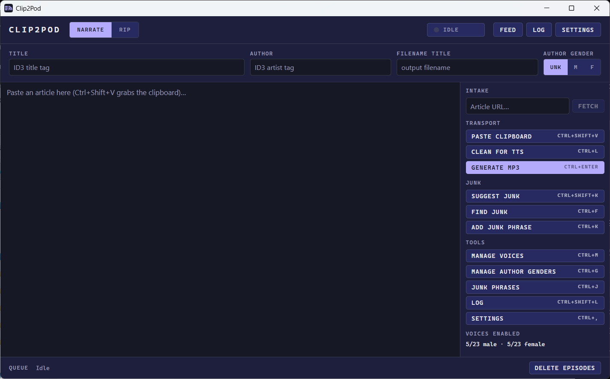
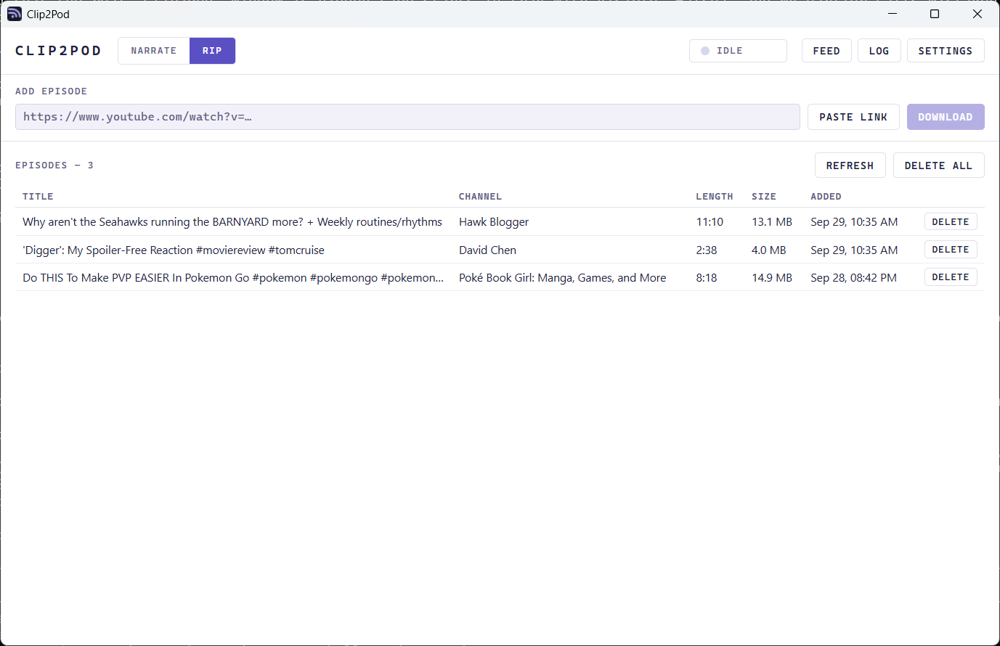

<p align="center">
  
</p>

<h1 align="center">Clip2Pod</h1>

<p align="center">
  Turn an article — or a video's audio — into your own private podcast feed.
</p>

<p align="center">
  <a href="LICENSE"></a>
  
  
  
  
</p>

---

<p align="center">
  
  
</p>

Clip2Pod is a desktop app that produces MP3 episodes and serves them over a local
RSS feed, so your phone's podcast app can subscribe and download them like any
other show. It has two modes:

- **Narrate** — paste an article (or send it from your browser), clean it up, and
  generate an MP3 read aloud by one of Microsoft Edge's neural text-to-speech
  voices.
- **Rip** — give it a video URL and it downloads the audio track as an MP3 (via
  [`yt-dlp`](https://github.com/yt-dlp/yt-dlp)).

Both produce tagged, safely-named MP3s in a folder that *is* the feed. The two
feeds are kept separate — a 6-minute narrated blog post and a 2-hour conference
talk are different listening experiences.

Everything runs on your machine and your LAN. No account, no cloud, no
per-character bill. The only outbound call is Edge's TTS service, and only when
you narrate.

## Modes

### Narrate — text → voice → MP3

**Four ways in:** paste from the clipboard (`Ctrl+Shift+V`), fetch an article by
URL, press the global hotkey (`Ctrl+Alt+G`) from anywhere, or click the browser
extension to send the page you're reading (paywalled content included — it
captures your logged-in session).

- **Readability extraction** strips nav, ads, and boilerplate down to title,
  author, and article text.
- **Script cleanup** — one-click *Clean for TTS* normalizes smart punctuation,
  strips emoji and decorative symbols, and collapses whitespace. A *junk phrase
  finder* walks you through lines that read badly aloud ("Getty Images", "min
  read", raw URLs), with an editable phrase list that supports `*` wildcards.
- **Spoken intros** — each episode opens with its title and author, skipped if the
  text already starts that way.
- **A real voice library** — audition, enable, and disable any of Edge's English
  neural voices. Voices rotate round-robin (and alternate gender when the author's
  is unknown) so a backlog doesn't sound monotonous. Right-click a bad take in the
  log to drop that voice.
- **Recognized authors** — the first time you pick Male or Female for an author,
  Clip2Pod remembers it (exact match on the Author field). The next article from
  that byline pre-fills the gender picker automatically, with a ring on the
  selected button so you can tell it came from memory rather than being left over
  from the last article. **Manage Author Genders** (`Ctrl+G`) lists everyone
  remembered, with rename, edit, delete, and merge (for byline variants of the
  same person).

### Rip — video URL → yt-dlp → MP3

- Paste a link, click **Paste link** to grab it from the clipboard, or send it
  from the extension. Known video hosts (YouTube, Vimeo, …) route here
  automatically.
- `yt-dlp` downloads and transcodes to MP3, embedding the thumbnail, metadata, and
  chapters, running SponsorBlock, and applying a small volume boost. The command
  template is fully editable in Settings.
- Live download progress per job; **Stop** kills the current one.
- Requires **`yt-dlp` and `ffmpeg` on your PATH** — the app is not bundled with
  them. The Rip tab shows an install notice with the `winget` commands if either
  is missing, and Settings shows the detected `yt-dlp` version. You can point at a
  specific `yt-dlp` build (e.g. a nightly) in Settings if rips start failing.

### Shared

- **Background queues** — narration and ripping run on independent workers, so you
  can rip a video while an article narrates. One header lamp reads both: `IDLE` /
  `QUEUED n` / `RENDERING` / `RIPPING` / `ON AIR`.
- **Proper MP3s** — ID3 tags, sanitized collision-safe filenames. They land in
  `Documents/Clip2Pod Feeds/Narrated` and `…/Ripped` unless you pick other
  folders in Settings.
- **Two podcast feeds** — a local RSS server (port `4738`) serves a narrated
  feed and a ripped feed, each behind a private URL. Open **Feed** on either
  tab, scan the QR code, and subscribe.
- **One-click cleanup** — once your podcatcher has the episodes, **Delete all**
  clears every MP3 the feed lists from that mode's folder (with a count
  confirmation; never a file still being written).
- **Quality of life** — light/dark themes, system tray (left-click to show;
  closing the window keeps it running), every setting persisted.

## Installation

### Prebuilt packages

Grab the latest build from the [Releases](../../releases) page:

| Package | For |
|---|---|
| `Clip2Pod_x.y.z_x64-setup.exe` | Windows (installer) |
| `Clip2Pod_x.y.z_x64_en-US.msi` | Windows (MSI) |
| `Clip2Pod_x.y.z_aarch64.dmg` | macOS, Apple Silicon (M1 and later) |
| `Clip2Pod_x.y.z_x64.dmg` | macOS, Intel |
| `Clip2Pod_x.y.z_amd64.AppImage` | Any Linux distro — `chmod +x` and run |
| `Clip2Pod_x.y.z_amd64.deb` | Debian, Ubuntu, Mint |
| `Clip2Pod-x.y.z-1.x86_64.rpm` | Fedora, openSUSE |

### Platform status

Clip2Pod is a personal project in public preview. How well each platform has been
tested:

- **Windows 11:** tested; this is the platform it's developed on.
- **Linux:** earlier versions were tested, mostly on CachyOS. The current build
  hasn't been tested yet.
- **macOS:** builds are produced but have never been tested.

On Linux under **Wayland**, the global hotkey (`Ctrl+Alt+G`) usually doesn't work,
because Wayland doesn't let apps grab keys system-wide. The tray menu and the
browser extension still work.

If you try it on Linux or macOS, a [bug report](../../issues/new/choose) saying
whether it works or not helps a lot.

### First launch

The builds aren't code-signed, so your OS will warn you the first time you open
the app:

- **Windows:** SmartScreen shows "Windows protected your PC". Click **More info**,
  then **Run anyway**.
- **macOS:** after dragging Clip2Pod into Applications, macOS may refuse to open
  it or say it's damaged. Clear the quarantine flag in Terminal, then open it
  normally:

  ```sh
  xattr -cr /Applications/Clip2Pod.app
  ```

For the **Rip** mode, install `yt-dlp` and `ffmpeg` yourself:

```sh
# Windows
winget install yt-dlp.yt-dlp
winget install yt-dlp.FFmpeg

# macOS / Linux
brew install yt-dlp ffmpeg        # or your package manager / pipx install yt-dlp
```

Narrate mode has no extra dependencies.

### Build from source

Prerequisites: [Rust](https://rustup.rs) (stable), [Node.js](https://nodejs.org)
18+, and the [Tauri 2 system dependencies](https://tauri.app/start/prerequisites/)
for your platform.

```sh
git clone https://github.com/FlocktimusPrime/Clip2Pod.git
cd Clip2Pod
npm install
npm run tauri build          # bundles land in src-tauri/target/release/bundle/
```

For development with hot reload: `npm run tauri dev`.

### Browser extension (Chrome / Brave / Edge / Firefox)

The extension sends the page you're reading — as rendered in your logged-in
session — to whichever mode fits.

- **Chrome / Brave / Edge:** `chrome://extensions` → enable **Developer mode** →
  **Load unpacked** → pick [`extension/chrome/`](extension/chrome/).
- **Firefox** (temporary): `about:debugging#/runtime/this-firefox` → **Load
  Temporary Add-on…** → pick [`extension/firefox/manifest.json`](extension/firefox/manifest.json).

**Click** the toolbar button and the app decides: a known video host goes to Rip,
everything else to Narrate. **Right-click the page** for "Narrate this page" /
"Rip this page's audio" to force a mode — handy for a YouTube page you want *read*
(its transcript) instead of ripped.

The extension only acts when you click, only on the active tab, and only talks to
`127.0.0.1:4737`. See [`extension/README.md`](extension/README.md).

## Usage

### Narrate an article

1. Copy an article (or click the extension, or paste a URL and hit **Fetch**).
2. **Paste Clipboard** (`Ctrl+Shift+V`); title and author auto-fill.
3. **Find Junk** (`Ctrl+F`) to review lines that read badly, `Ctrl+D` to delete —
   or skip to **Clean for TTS** (`Ctrl+L`).
4. Check the metadata bar (Title, Author, Author gender).
5. **Generate MP3** (`Ctrl+Enter`). It queues; keep working while it renders.

### Rip a video

1. Switch to the **RIP** tab (or just send a video link from the extension).
2. Paste the URL and hit **Download** (or **Paste link** to use the clipboard).
3. Watch it in the Queue; the finished MP3 lands in the ripped-audio folder.

### Subscribe on your phone

1. Click **Feed** on the tab whose feed you want.
2. Scan the QR code, or enter the shown `http://<your-ip>:4738/tts/<token>/feed.xml`
   (or `/video/<token>/feed.xml`) in any podcast app on the same network. The
   token keeps others on your Wi-Fi out; **Reset feed URL** issues a new one if the
   URL leaks, and every device then has to re-subscribe.
3. After your podcatcher downloads the episodes, **Delete all** clears that
   folder for the next batch.

### Keyboard shortcuts (NARRATE tab)

| Shortcut | Action |
|---|---|
| `Ctrl+Alt+G` | **Global** — summon Clip2Pod and paste the clipboard, from any app |
| `Ctrl+Shift+V` | Paste clipboard (replaces editor) |
| `Ctrl+F` | Find next junk phrase |
| `Ctrl+K` | Add selection as junk phrase |
| `Ctrl+Shift+K` | Suggest junk phrases from the script |
| `Ctrl+D` | Delete current line |
| `Ctrl+L` | Clean text for TTS |
| `Ctrl+Enter` | Generate MP3 |
| `Ctrl+J` | Edit junk phrases |
| `Ctrl+M` | Manage voices |
| `Ctrl+G` | Manage Author Genders |
| `Ctrl+Shift+L` | Open the log (the active tab's) |
| `Ctrl+,` | Settings |

A full feature walkthrough lives in [ABOUT.md](ABOUT.md).

## How it works

```
NARRATE   clipboard / URL / hotkey / extension
             │  readability + junk-phrase cleanup
             ▼  Edge TTS (chunked, frames concatenated) → ID3 → /tts feed

RIP       video URL / extension
             │  yt-dlp + ffmpeg (extract-audio, embed, SponsorBlock)
             ▼  duration tag → /video feed

          one capture listener (:4737, routes by host) ─┐
          one LAN RSS server  (:4738, /tts + /video)  ──┴─▶  phone subscribes
```

| Component | Role |
|---|---|
| `src/` | SvelteKit 5 frontend — a shared header + tab shell over the NARRATE desk and the RIP list |
| `src-tauri/src/` | Tauri 2 shell — tray, global hotkey, capture listener (`:4737`), feed server (`:4738`), two workers |
| `src-tauri/crates/clip2pod-core/` | Narrate logic (AGPL-3.0) — extraction, cleaning, TTS, voice cycling, tagging, feed |
| `src-tauri/crates/clip2pod-rip/` | Rip logic (GPL-3.0) — yt-dlp arg building, progress parsing, feed |
| `extension/` | Manifest V3 browser extension (Chrome + Firefox) — posts the rendered page, plus a mode hint |

Narration uses **Microsoft Edge's neural TTS service** (via
[`msedge-tts`](https://crates.io/crates/msedge-tts)); extraction uses
[`dom_smoothie`](https://crates.io/crates/dom_smoothie), a Rust Readability port.
Long articles are chunked on sentence boundaries and the MP3 frames concatenated,
so a full article narrates as one file. Ripping shells out to the system `yt-dlp`.

> **Note:** `msedge-tts` is an unofficial client. Microsoft doesn't offer Edge's
> read-aloud service as a public API, so narration may stop working if Microsoft
> changes it. Rip mode doesn't depend on it.

## Privacy

- Text you narrate is sent to Microsoft's Edge TTS service — the same service
  Edge's "Read aloud" uses. Don't feed it text you wouldn't paste into a cloud
  service.
- Ripping talks to whatever site `yt-dlp` fetches from; nothing else leaves your
  machine.
- The browser extension talks only to `127.0.0.1` and only when you click it.
- The podcast feeds bind to your LAN (`0.0.0.0:4738`) so your phone can reach
  them; they serve only your episodes and cover art.
- No telemetry, no accounts, no data collection.

## Development

```sh
npm run tauri dev              # run with hot reload
npm run check                  # svelte-check (frontend types)
cargo test --workspace         # Rust tests (run from src-tauri/)
cargo clippy --workspace       # lints
```

The core crates have no Tauri dependency, so most behavior — cleaning, voice
cycling, collision handling, feed XML, yt-dlp arg building, progress parsing — is
covered by fast unit tests.

## Built with Claude Code

Clip2Pod was built with [Claude Code](https://claude.com/claude-code), Anthropic's
AI coding agent: Claude Code wrote most of the code, and I set the direction,
reviewed the changes and tested the builds. The files that steer it are kept in
the repo so you can see how it was made:

- [`CLAUDE.md`](CLAUDE.md): project instructions for the agent.
- [`.claude/`](.claude/): project agents, skills and hooks (for example, the
  reviewers that guard the AGPL/GPL boundary between the two cores).
- [`docs/superpowers/`](docs/superpowers/): the design specs and implementation
  plans written before each feature.
- [`.impeccable/`](.impeccable/): the UI design context.

## License

[GNU AGPL-3.0](LICENSE) © 2026 FlocktimusPrime

Clip2Pod is free software: use, study, modify, and redistribute it, but any
distributed or network-hosted derivative must ship full source under the same
license. The Rip logic (`clip2pod-rip`) is GPL-3.0-only; AGPLv3 §13 permits
combining it into this AGPL program, and the effective license of the whole
binary is AGPL-3.0.

## Acknowledgements

- [Tauri](https://tauri.app) — the desktop shell
- [msedge-tts](https://crates.io/crates/msedge-tts) — Microsoft Edge neural TTS bindings
- [dom_smoothie](https://crates.io/crates/dom_smoothie) — Readability-style article extraction
- [yt-dlp](https://github.com/yt-dlp/yt-dlp) — the ripping engine
- [CodeMirror](https://codemirror.net) — the script editor
